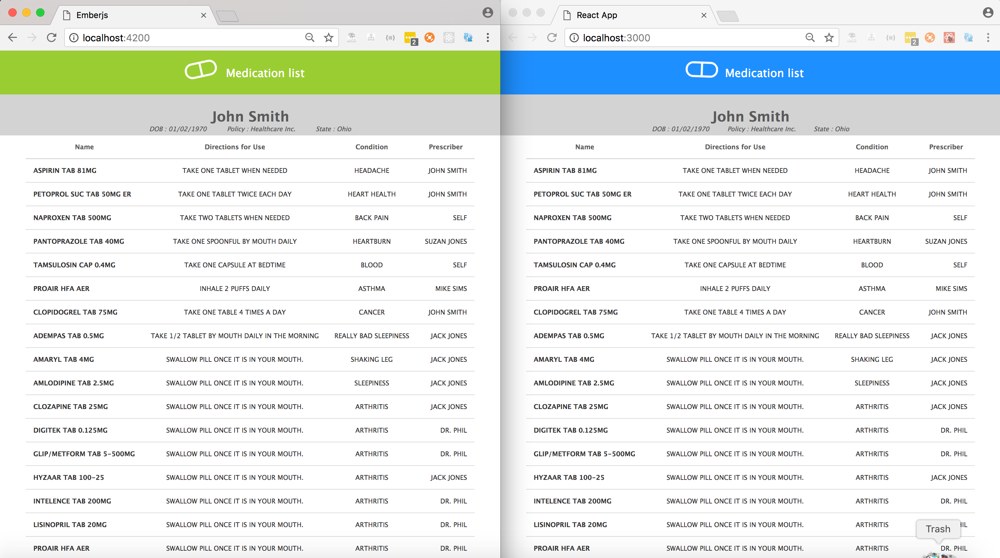

# Med list sample application

This application provides a simulation medication list that is backed by a mock rest server written in go. That is not the important 
part here but look at it as something that you cannot touch and must deal with. 

There are 2 applications that could be used, a reactjs version and an emberjs version.

## Possible scenarios to do for audition

1. Wire in a way to search for a medication and filter the data shown in the table
2. Implement adding/deleting of a medication into the front end
